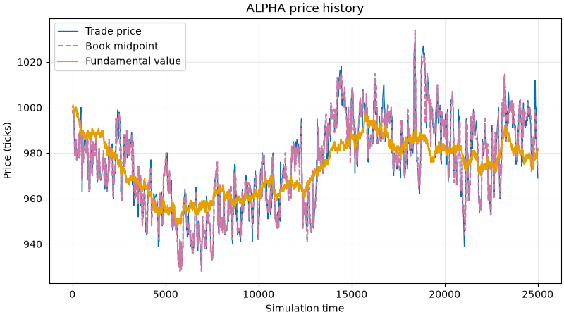

# Mini Stock Exchange

[](https://github.com/wlucas30/mini-stock-exchange/actions/workflows/main.yml) 

This is a Python-based electronic exchange simulator. The exchange contains
3 default instruments. A limit-order-book matching engine allows prices to
emerge for each instrument from orders submitted by participants. The engine
applies price-time priority and records completed trades without directly
setting the market price for an instrument.

Algorithmic market participants (agents) can be configured to trade on the 
exchange by specifying the amount and type of these agents in the configuration 
CSV files. There are many strategies an agent may follow, detailed in 
[`docs/agents.tex`](docs/agents.tex).



## Features

- Limit and market orders
- Partial fills, order cancellation and expiring limit orders
- Cash and position reservation for open orders
- Independent order books for multiple instruments
- Configurable participants, instruments and initial holdings using CSV files
- Automatic simulation time with fast-forwarding
- Noise, fundamental, momentum, market-making and long-term-holder agents
- Hidden fundamental values with sentiment and changing volatility
- Persistent, imperfect fundamental-value estimates for informed agents
- Price, midpoint, fundamental-value, and participant-performance graphs
- Rolling spread, volume, VWAP and volatility statistics

## How it works

The project is split into three main layers:

1. The **exchange** owns participants, instruments, order books, reservations,
   and trades.
2. The **simulation** advances the clock, evolves hidden market state, invokes
   each automated agent, while recording price and participant histories.
3. The **command layer** handles the user interface, executing commands from
   user input and rendering text, tables and figures.

## Trading agents

The default simulation contains several deliberately different strategies:

- **Noise traders** generate uninformed buy and sell activity around public
  market prices.
- **Fundamental traders** trade when the market differs sufficiently from
  their own imperfect estimate of fundamental value.
- **Momentum traders** use a 20-step and 100-step moving-average crossover.
- **Market makers** maintain two-sided quotes while managing their inventory.
- **Long-term holders** retain most of the issued shares and do not trade.

Agents never receive the exact hidden fundamental value. Informed agents and
market makers instead maintain individual, noisy estimates which evolve over
time.

## Requirements

- Python 3.14

## Setup

Create and activate a virtual environment:

```bash
python3.14 -m venv .venv
source .venv/bin/activate
```

Install the project:

```bash
python -m pip install -e '.[dev]'
```

## Running the simulation

Start the interactive command loop from the repository root:

```bash
python main.py
```

The default configuration creates three instruments `ALPHA`, `BETA`, and
`GAMMA`, along with several automated participants and their initial cash and
positions. Prices are integer ticks, where one tick represents one cent.

Commands and identifiers are uppercase. An example first session is:

```text
LIST INSTR
LIST PARTICIPANT
SHOW BOOK ALPHA
FAST FORWARD 100000
SHOW STATS ALPHA
SHOW GRAPH ALPHA
SHOW PERFORMANCE FUNDAMENTAL_1
```

`FAST FORWARD` processes every intermediate simulation step and displays a
terminal progress bar. Graph commands open a Matplotlib window.

You can also add participants and instruments or submit orders manually:

```text
ADD PARTICIPANT ALICE
ADD INSTR AAPL PRICE 10000 VOLUME 1000
AS ALICE BUY AAPL LIMIT PRICE 9950 QUANTITY 10
SHOW PARTICIPANT ALICE
SHOW TRADES
```

The order-placement response includes the assigned order ID. It can be used to
cancel the order later with `AS ALICE CANCEL ORDER <order_id>`.

The full command grammar and examples are documented in
[`docs/commands.tex`](docs/commands.tex). The behaviour and information access
of each automated strategy are described in
[`docs/agents.tex`](docs/agents.tex).

## Default configuration

The startup state is defined by three CSV files:

- [`config/default_instruments.csv`](config/default_instruments.csv) defines
  instrument symbols, starting prices and total supplies.
- [`config/default_agents.csv`](config/default_agents.csv) defines participant
  identities, starting cash and strategies.
- [`config/default_agent_positions.csv`](config/default_agent_positions.csv)
  allocates the complete initial supply of every instrument.

Changing these files makes it possible to experiment with different market
structures without modifying the Python source.

## Design scope

This is an educational market simulation rather than a production trading
system or a model of any particular real exchange. Market mechanics are
simplified and agent strategies are intentionally rudimentary.

Participant performance is recorded on every simulation step, so memory usage
grows with both simulation length and participant count. Very long runs may
therefore require history sampling or persistent storage in a future version.

Possible future work includes additional agent strategies, configurable
strategy parameters and potentially including other instrument categories
such as derivatives and fixed-income assets.
